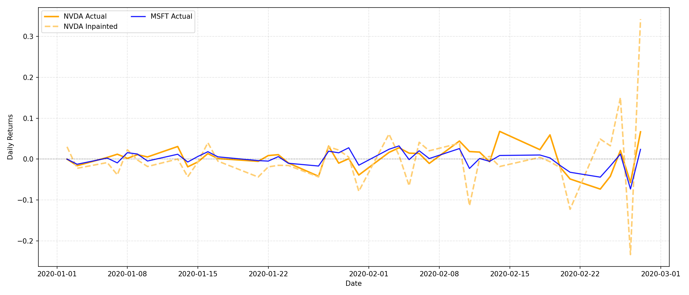

# Diffusion Models for Stocks

Testing diffusion models for stock prediction. Diffusion models have been successfully implemented in NLP, so I wanted to explore their potency in stock returns. I got inspired by this [arXiv paper](https://arxiv.org/html/2402.06656v1).

## Setup

1. Install requirements:
   ```bash
   pip install -r requirements.txt
   ```

2. Download full S&P 500 dataset from [Kaggle](https://www.kaggle.com/datasets/camnugent/sandp500) if you want to test this on other stocks.
   - The repository includes 3 sample stocks (NVIDIA, Microsoft, Google) in the `stocks/` directory

## Project

This project implements a **1D Diffusion Model** (DDPM) for stock return prediction with a comprehensive backtesting and portfolio management system.

### Core Components:
- **UNet1D**: 1D convolutional neural network with skip connections for time series modeling
- **Diffusion Process**: Implements DDPM with cosine noise schedule and v-parameterization  
- **Cross-Stock Prediction**: Uses GOOG+MSFT correlations (tech sector) to infer NVDA behavior
- **Training Pipeline**: Includes EMA (Exponential Moving Average) and mixed precision training

### Portfolio Management Engine:
- **Walk-Forward Backtesting**: Cost and risk-aware backtesting with realistic transaction costs
- **Kelly Sizing**: Optimal position sizing using Kelly criterion with lookback periods
- **Risk Management**: VaR limits, maximum drawdown constraints, and position size limits
- **Market Impact Models**: Square-root and linear market impact cost modeling
- **Monte Carlo Stress Testing**: Portfolio stress testing with multiple scenarios
- **Interactive Dashboard**: Real-time performance visualization and analytics

## Usage

1. **Train the model**:
   ```bash
   python train.py
   ```

2. **Run backtesting with interactive dashboard**:
   ```bash
   python backtest.py
   ```
## Results



The example shows NVDA prediction during a period with different market conditions than the training data. The model uses inpainting; treating missing NVDA data as "blank channels" and filling them based on observed GOOG+MSFT patterns.

## Observations

The model maintains some realistic properties of stock data; preserving fat-tailed return distributions and temporal autocorrelations where recent movements are more predictive than distant ones.

Compared to GANs I tested earlier, diffusion models seem more stable and **avoid mode collapse** when generating financial time series.

This was just an initial experiment inspired by the diffusion transformers paper mentioned above, and next steps would be implementing it.
